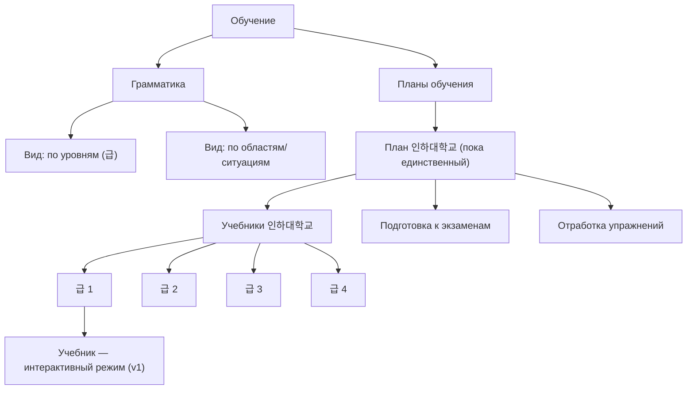

# 3. Справочник (словарь) и раздел «Обучение»

Статус: черновик — часть открытых вопросов снята, один остаётся принципиально открытым до реализации (см. «Открытые вопросы» в конце). Фаза 2, после MVP (`0-mvp.md` явно исключает модули грамматики и подготовки к TOPIK из MVP-скоупа — это они).

## 1. Справочник / Словарь

### 1.1 Модель данных: ключевое решение

**Вопрос:** для каждого типа сущности (слова, фразы, грамматики) — одна таблица с nullable `owner_user_id` (глобальные и приватные строки вперемешку) или две отдельные таблицы (`global_words` + `user_words`)?

**Решение: одна таблица на тип, `owner_user_id uuid NULL`.** `NULL` = глобальная запись, значение = приватная запись конкретного пользователя.

Почему не две таблицы:

1. **Комбинированный поиск/чтение — один запрос вместо union.** Пользователь должен видеть «мои слова + глобальные» в одном списке результатов поиска. С одной таблицей это `WHERE owner_user_id IS NULL OR owner_user_id = auth.uid()`. С двумя таблицами — `UNION` двух запросов с разными правами доступа, менее очевидная RLS-модель.
2. **Продвижение (promotion) слова из пользовательского в глобальное — без смены идентичности строки.** Ты планируешь позже брать популярные пользовательские слова и добавлять их в глобальный набор. С одной таблицей это `UPDATE words SET owner_user_id = NULL WHERE id = ...` — id строки не меняется. С двумя таблицами это `DELETE` из одной + `INSERT` в другую — новый id. Это важно не само по себе, а потому что: если слова когда-нибудь станут материалом для флэшкарт/SRS (весь остальной MVP построен вокруг `item_id` как стабильного якоря для `progress`/`review_events`, см. ADR-0001) — смена id при продвижении молча оторвёт прогресс пользователя от слова. Одна таблица с nullable `owner_user_id` исключает эту проблему по конструкции.
3. **RLS естественно ложится на одну таблицу**: `USING` для `SELECT` пускает и глобальные, и свои строки; `WITH CHECK` на `INSERT`/`UPDATE` требует `owner_user_id = auth.uid()` — то есть пользователь физически не может создать или изменить глобальную строку через обычную сессию. Запись глобальных строк — только через `service_role` (раздел 1.4).

### 1.2 Схема (черновой словарь данных)

**`words`** (v1: единственная таблица с полноценным UI добавления)

| Поле | Тип | Обяз. | Описание |
|---|---|---|---|
| `id` | uuid | да | PK |
| `owner_user_id` | uuid, FK → `auth.users` | нет | `NULL` = глобальная запись |
| `external_id` | text, unique | да | Стабильный человекочитаемый ключ — основа идемпотентного импорта (см. 1.4) и будущий якорь для progress/SRS, если словарь станет материалом для карточек. Тот же принцип, что `item_id` в ADR-0001 |
| `headword` | text | да | Корейское слово |
| `reading` | text | нет | Романизация/чтение |
| `part_of_speech` | text | нет | Часть речи |
| `translations` | text[] | да | Значения (может быть несколько) |
| `examples` | jsonb | нет | `[{ "kr": "...", "ru": "..." }]` |
| `level_tag` | text | нет | Например `TOPIK1` — пригодится и для фильтрации, и для будущей связки с уровнями Обучения |
| `created_at`, `updated_at` | timestamptz | да | |

**`phrases`, `grammar_points`** — та же форма схемы (`id`, `owner_user_id` nullable, `external_id`, поля контента, `created_at`/`updated_at`), заведённая сейчас, чтобы не мигрировать RLS позже. Разница — только в полях контента:
- `phrases`: `phrase_kr`, `translation`, `usage_note`
- `grammar_points`: `pattern` (например `-아/어서`), `level_tag`, `area_tags text[]` (темы/ситуации — нужны для просмотра с фильтрами в разделе Обучение, см. 2.1), `explanation`, `examples jsonb`

Никакого отдельного поля `source`/`is_global` не заводим — это производное от `owner_user_id IS NULL`, дублировать состояние в двух местах означает завести способ им рассинхронизироваться.

### 1.3 RLS (по аналогии с `progress`/`review_events` из `0-mvp.md`)

| Таблица | `SELECT` | `INSERT`/`UPDATE`/`DELETE` (обычный пользователь) |
|---|---|---|
| `words` | `owner_user_id IS NULL OR owner_user_id = auth.uid()` | `WITH CHECK (owner_user_id = auth.uid())` — только свои приватные строки; глобальные (`NULL`) не редактируются пользователем никогда |
| `phrases`, `grammar_points` | `owner_user_id IS NULL OR owner_user_id = auth.uid()` (политика уже такая в v1, хотя писать некому) | Политики нет вообще в v1 — таблица открывается на запись обычным пользователям только когда фича добавления фраз/грамматик реально появится |

Глобальные строки во всех трёх таблицах пишутся только через `service_role` (импорт-скрипт, раздел 1.4) — тот же принцип, что уже зафиксирован в `0-mvp.md`: `service_role` только в серверном окружении, обходит RLS для административных задач.

### 1.4 Как загрузить JSON-словарь в базу (практическое объяснение)

Ты генерируешь JSON-файл с помощью ИИ → он должен попасть в таблицу `words` (или `phrases`/`grammar_points`) как глобальные строки. Прямой путь «просто вставить через обычную сессию» не работает — RLS не пускает обычного пользователя писать глобальные строки, это осознанное ограничение из раздела 1.3. Значит, нужен административный скрипт с `service_role` key — точно то, для чего этот ключ и был зарезервирован в `0-mvp.md`.

**Формат JSON** (`content/dictionary/words.json`):

```json
[
  {
    "external_id": "word-감사하다-001",
    "headword": "감사하다",
    "reading": "gamsahada",
    "part_of_speech": "verb",
    "translations": ["благодарить", "быть благодарным"],
    "examples": [
      { "kr": "도와주셔서 감사합니다.", "ru": "Спасибо, что помогли." }
    ],
    "level_tag": "TOPIK1"
  }
]
```

Заготовка для `phrases.json` / `grammar.json` — тот же принцип (массив объектов, обязательно с `external_id`), поля — по схеме из 1.2.

**Где хранить файл:** в самом репозитории, `content/dictionary/*.json` — это не код, но версионируется вместе с проектом, у тебя бесплатно появляется git-история изменений словаря (кто/когда поправил перевод).

**Скрипт импорта** (`scripts/import-dictionary.ts`, запускается вручную, не часть CI — тот же характер решения, что «миграции Supabase вручную» в `1-cicd-and-testing.md`):

```ts
import { createClient } from '@supabase/supabase-js'
import fs from 'node:fs'

const supabase = createClient(
  process.env.SUPABASE_URL!,
  process.env.SUPABASE_SERVICE_ROLE_KEY!   // только локально/в .env, никогда не коммитится
)

const [, , tableName, filePath] = process.argv
const rows = JSON.parse(fs.readFileSync(filePath, 'utf-8'))

const { error } = await supabase
  .from(tableName)                         // 'words' | 'phrases' | 'grammar_points'
  .upsert(
    rows.map((r: any) => ({ ...r, owner_user_id: null })),
    { onConflict: 'external_id' }
  )

if (error) throw error
console.log(`${tableName}: импортировано/обновлено ${rows.length}`)
```

Запуск: `pnpm tsx scripts/import-dictionary.ts words content/dictionary/words.json`.

**Идемпотентность.** `upsert` с `onConflict: 'external_id'` — повторный запуск с тем же файлом ничего не задваивает; если поправишь перевод в JSON и перезапустишь скрипт, обновится существующая строка (по `external_id`), а не создастся вторая. Это именно то, зачем в схеме есть `external_id`, а не расчёт на автоинкрементный `id` из базы — та же логика, что уже объяснялась про `item_id` в ADR-0001, только здесь она защищает не прогресс пользователя, а сам словарь от задвоения при повторных загрузках.

**На будущее (не строить сейчас):** «найти популярные слова у пользователей, которых нет в глобальном наборе» — это обычный SQL-запрос (`GROUP BY headword` по строкам с `owner_user_id IS NOT NULL`, отфильтровать те, которых нет среди глобальных). Никакой новой инфраструктуры под это не нужно — модель данных уже готова, вопрос только в том, когда ты решишь этим заняться.

### 1.5 Поиск

Пользователь сначала выбирает тип (слова | фразы | грамматики), затем ищет — это определяет, к какой таблице идёт запрос, а не доп. фильтр внутри одного общего запроса.

```sql
select * from words
where (owner_user_id is null or owner_user_id = auth.uid())
  and headword ilike '%' || :query || '%'
```

`ILIKE`-поиск по подстроке достаточен для v1 — объём данных небольшой. Полнотекстовый поиск (`tsvector` + GIN-индекс) — если глобальный набор сильно вырастет или понадобится опечатко-устойчивый поиск; не строить заранее.

## 2. Раздел «Обучение»

### 2.1 Информационная архитектура



Если у уровня ровно один учебник — переход с `E → H1` сразу открывает `I`, без промежуточного списка из одного элемента.

### 2.2 Модель данных

- **`learning_plans`** (`id`, `title`, ...) — в v1 ровно одна строка («План 인하대학교»).
- Подразделы плана (Учебники / Подготовка к экзаменам / Отработка упражнений) **не моделируются как данные** в v1 — это фиксированные роуты/вкладки в коде (`features/learning/plans/inha/{textbooks,exam-prep,exercises}`). Плана пока один и структура жёсткая — строить под него гибкую систему «разделов плана» сейчас означает проектировать под потребность, которой ещё нет. Пересмотреть, когда появится второй план с другой структурой подразделов.
- **`textbooks`** — `id`, `plan_id` (**обязательное**, `NOT NULL` — учебник всегда принадлежит одному плану, подтверждено), `level` (int, без ограничения диапазона — см. ниже про число уровней), `title`. Без `pdf_storage_path` — решение хранить учебник как непрозрачный PDF пересмотрено, см. **ADR-0002**: пилот на уроке 1 показал, что ручная пиксель-точная вёрстка каждой страницы под оригинал не переиспользуется между страницами и стоит кратно дороже на масштабе всего учебника, чем один раз построенные компоненты рендера для структурированных данных.
- **`textbook_pages`** (новая, введена ADR-0002) — `id`, `textbook_id` (`NOT NULL`), `page_number` (int), `lesson_number` (int, nullable — у оглавления/указателя номера урока нет), `content` (`jsonb`) — набор блоков страницы: `{"blocks": [{"type": "dialogue", ...}, {"type": "vocab_table", ...}, {"type": "illustration", "storage_path": "..."}, {"type": "exercise_list", ...}, ...]}`. Гранулярность на уровне страницы (не отдельного блока/слова) — сознательно: разбивать до блока имеет смысл только когда упражнения реально начнут программно вытаскивать «слово с такой-то страницы»; заводить это впрок, не имея такой потребности сейчас, преждевременно — тот же принцип, что уже применялся к подразделам плана выше. Отдельные блоки страницы (кроме `lesson_toc`) несут ещё `id` (стабильный слаг блока в пределах урока) и `toc_section` (какому разделу `lesson_toc` принадлежат) — нужно для перехода из состава урока прямо к конкретному блоку, см. `4-textbook-content-authoring.md`.
- **`lessons`** (`id`, `textbook_id` `NOT NULL`, `lesson_number`, `title`, `unique(textbook_id, lesson_number)`) — название урока на корейском (например «인사와 소개» для урока 1), используется для отображения «1과. {title}» в списке уроков и заголовке урока. Раньше не было отдельного места для этого — `lesson_number` лежал только на `textbook_pages`, самого названия урока в БД не было вовсе.
- **Уровни (급).** Решение — в v1 заводим 4 уровня, хотя у большинства корейских университетских программ (включая обычно и Инха) шкала обычно 1–6급. `textbooks.level` — обычный `int` без `CHECK`-ограничения диапазона специально: добавить 5-й и 6-й уровень позже — это просто новые строки, не миграция схемы.
- **Переиспользование контента учебника другими подразделами плана.** Подтверждено: «Подготовка к экзаменам» и «Отработка упражнений» того же плана должны уметь использовать данные из учебника (например, слова или предложения из конкретного учебника — как материал для упражнений). После ADR-0002 это доступно уже в v1: содержимое `textbook_pages.content` — данные, а не картинка, поэтому упражнения могут программно ссылаться на конкретный блок конкретной страницы. Раньше это было отложено до появления интерактивного режима — теперь он и есть режим v1, ждать больше нечего.
- **Storage**: иллюстрации (сами файлы изображений, не текст) остаются бинарными ассетами в Supabase Storage — путь к файлу лежит внутри соответствующего блока `content` (`{"type": "illustration", "storage_path": "..."}`), доступ через подписанный URL, выданный сервером после проверки сессии.

## 3. Use cases

### US-1: Поиск в справочнике
Как пользователь, я хочу выбрать тип (слова/фразы/грамматики) и найти нужную запись, чтобы быстро посмотреть перевод или объяснение.

- [ ] Пользователь выбрал «Слова», ввёл часть слова — видит совпадения среди глобальных + своих
- [ ] Ничего не найдено — экран пустого состояния с подсказкой, а не пустой список
- [ ] Гость (не залогинен) ищет — видит только глобальные результаты, свои приватные слова не показываются (их просто нет)

```gherkin
Given пользователь на экране поиска, тип «Слова» выбран
When вводит «감사»
Then видит список слов, содержащих «감사», из глобального набора и своих приватных
```

### US-2: Пользователь добавляет своё слово
Как пользователь, я хочу добавить слово, которого нет в глобальном наборе, чтобы оно сохранилось у меня в справочнике.

- [ ] Слово сохраняется с `owner_user_id = auth.uid()`, видно только этому пользователю
- [ ] Попытка добавить слово с `owner_user_id` другого пользователя (испорченный запрос) — отклоняется RLS
- [ ] Кнопки добавления фразы/грамматики в v1 нет — только слова

```gherkin
Given пользователь залогинен, находится в разделе «Слова»
When добавляет новое слово с переводом
Then слово появляется в его поиске, но не видно другим пользователям
```

### US-3: Просмотр учебника в интерактивном режиме
Как пользователь, я хочу открыть учебник своего уровня и листать его страницы, свёрстанные из структурированных данных, а не как статичную картинку/PDF.

- [ ] Открытие страницы учебника запрашивает данные `textbook_pages` (RLS: чтение доступно любому аутентифицированному пользователю), иллюстрации внутри страницы — по подписанному URL из Storage
- [ ] Страницы учебника, однажды открытые онлайн, доступны офлайн (кешируются как обычные данные приложения, вне event log из ADR-0001 — контент учебника статичен, не требует синхронизации)
- [ ] Нет учебника для уровня — экран с сообщением, не пустая белая страница
- [ ] Каждый тип блока (`dialogue`, `vocab_table`, `illustration`, `exercise_list`, ...) рендерится одним переиспользуемым компонентом — общим для всех уроков и уровней, не завязанным на конкретный урок

### US-4: Навигация к учебнику через план обучения
Как пользователь, я хочу дойти до конкретного учебника через Обучение → Планы → План → Учебники → Уровень.

- [ ] На уровне с одним учебником переход сразу открывает его, без промежуточного списка
- [ ] На уровне без учебников — явное «скоро появится», не пустой экран без объяснения

### US-5: Владелец загружает/обновляет глобальный словарь
Как владелец приложения, я хочу прогнать JSON-файл через скрипт и увидеть, что записи создались или обновились.

- [ ] Повторный запуск с тем же файлом не создаёт дублей (идемпотентность по `external_id`)
- [ ] Изменённое поле (например, перевод) в JSON обновляет существующую строку при повторном запуске
- [ ] Скрипт требует `SUPABASE_SERVICE_ROLE_KEY` из локального `.env`, не работает с `anon`-ключом

## Открытые вопросы

### Снято

2. **Число уровней (급).** Решение: v1 — 4 уровня, `level` — обычный `int` без ограничения диапазона, добавление 5–6 уровней позже не требует миграции схемы (см. раздел 2.2).
3. **Написание названия университета.** Проверено: официальное написание — **인하대학교 (Inha University)**, «인하데학교» в исходном сообщении — опечатка (데 → 대). Источник: официальный сайт `inha.ac.kr` и его поддомены. Один нюанс остаётся у тебя: у Университета Инха встречаются два разных названия для программ корейского для иностранцев — **한국어교육센터** (Korean Language Education Center, `ltc.inha.ac.kr`) и **한국어학당** (Korean Language Institute, встречается в соцсетях) — это может быть один и тот же центр под двумя названиями или два разных подразделения. Название самого университета (인하대학교) в плане/учебниках использовать можно уверенно; если хочешь указать ещё и название конкретного языкового центра — свериться с тем, что написано в твоих собственных учебных материалах/студенческом билете, это надёжнее любого поиска.
4. **`textbooks.plan_id`.** Подтверждено обязательным — учебник всегда принадлежит одному плану. Заодно выяснилось, что «Подготовка к экзаменам» и «Отработка упражнений» того же плана должны переиспользовать данные учебника — см. следствие в разделе 2.2. Изначально это было отложено до появления интерактивного/структурированного режима учебника — после **ADR-0002** этот режим и есть v1, так что переиспользование доступно сразу, без дополнительной фазы.
5. **Учебник: PDF или структурированный/интерактивный режим в v1.** Решение пересмотрено после практического пилота (урок 1 «새인하한국어1» вручную свёрстан как PDF). Итог зафиксирован в **ADR-0002**: v1 сразу использует структурированный контент (`textbook_pages`, `content jsonb`) и переиспользуемые компоненты рендера по типу блока — не PDF. Причина — стоимость ручной вёрстки под оригинал не переиспользуется между страницами и растёт кратно на масштабе всего учебника (16 уроков × несколько страниц), тогда как структурированные данные требуют дороже войти, но переиспользуют компоненты на все уроки и уровни.

### Остаётся открытым

1. **`grammar_points` — одна сущность или две разные?** Твой ответ: «не совсем, полностью поймём при реализации» — то есть моя рабочая гипотеза (одна таблица, два интерфейса доступа: поиск в Справочнике vs просмотр-с-фильтрами в Обучении) **не подтверждена и не отвергнута**, решение сознательно отложено до момента реализации этой части. Схема раздела 1.2 остаётся черновой в этой части — не строить на ней миграции БД до того, как вопрос закроется.
